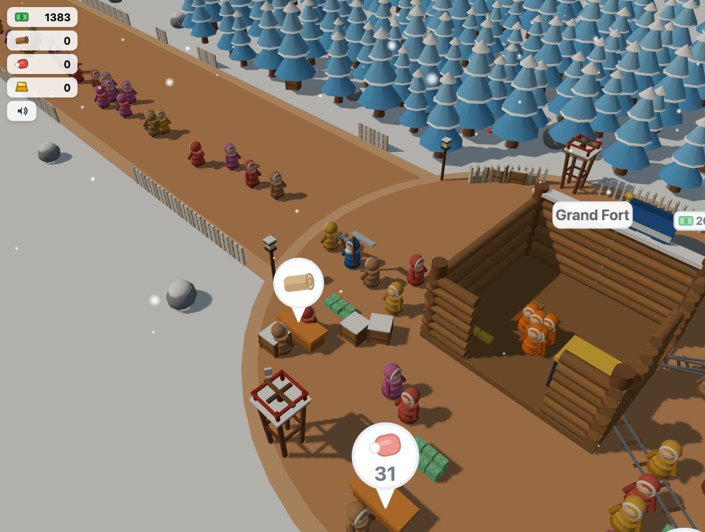
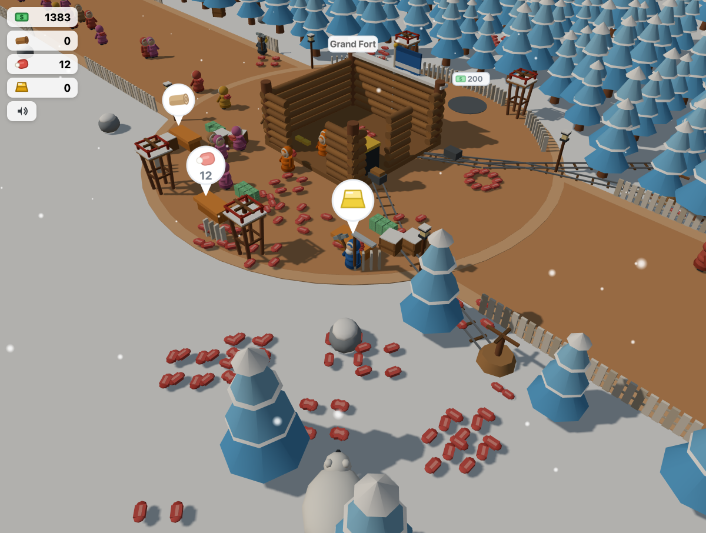
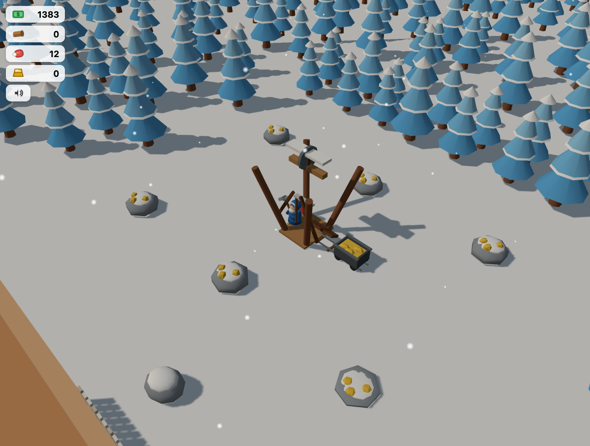

# Frostfall Camp

An arcade-idle winter survival game for the browser, inspired by the *Whiteout
Survival* playable ad — rebuilt from scratch with original art and code, then
evolved through live play into its own game.

Chop a gigantic (and ever-growing) forest, hunt bears, mine gold, and sell it
all to the queue of customers at your camp's stands. Pour wood into your base
to grow it from a shelter hut into a grand fort with a hauling crew, gold
miners, crossbow turrets, sawmills, and minecart lines. Defend the compound —
bear packs raid your meat stores. There is no ending: repeatable expeditions
push the world border outward forever, seeding fresh wilderness each time.

## Screenshots

Customers queue at the compound's stands while the crew works the Grand Fort:



The aftermath of a bear raid — arrow towers on the perimeter, and every steak
on the snow was a raider:



The automated gold mine, its cart filling as the miners work the outcrops:



## Requirements

- [Node.js](https://nodejs.org) 18 or newer (includes npm)
- A desktop browser (Chrome or Safari recommended)

## Install & play

```bash
git clone https://github.com/kelsorj/WinterClaude.git
cd WinterClaude
npm install
npm run dev
```

Open the URL Vite prints (usually `http://localhost:5173`) and you're playing.

- **Move**: WASD / arrow keys, or click-drag
- Everything else is proximity-based: stand near trees, bears, benches, or
  unlock pads and things happen
- **Esc** pause (and lifetime stats) · **M** or the speaker button to mute

Progress autosaves to the browser every few seconds.

## Build

```bash
npm run build      # static bundle in dist/
npm run preview    # serve the built game
npm test           # ~230 headless logic tests
```

## Tech

Vite + TypeScript + Three.js. Game logic is plain-TS systems over a single
state object (fully unit-tested, no rendering dependencies); the renderer
mirrors state into procedural low-poly meshes (the entire forest is two
GPU-instanced draw calls). Design history — the original spec and six
play-driven amendments — lives in `docs/superpowers/specs/`.
